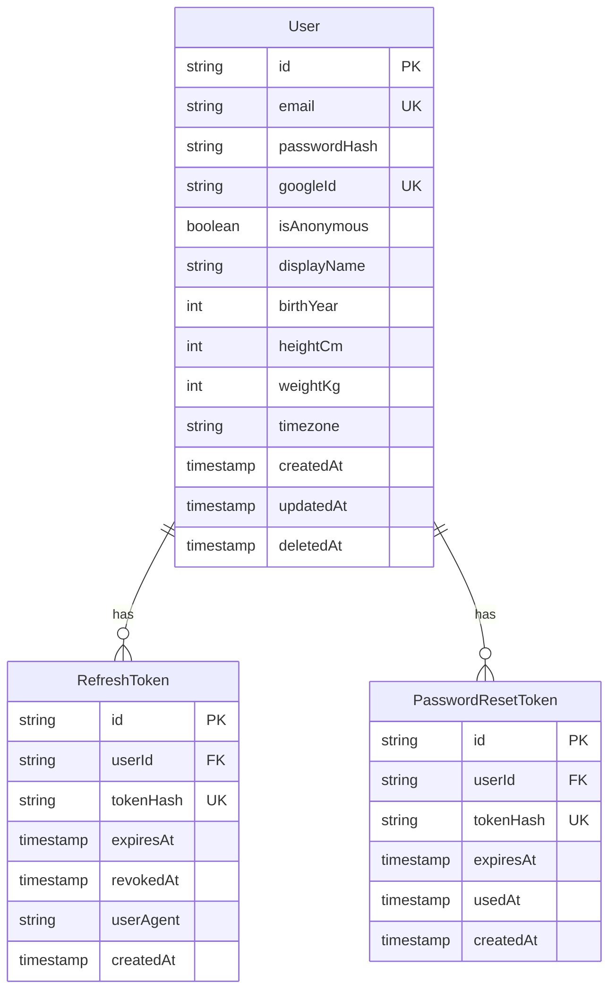
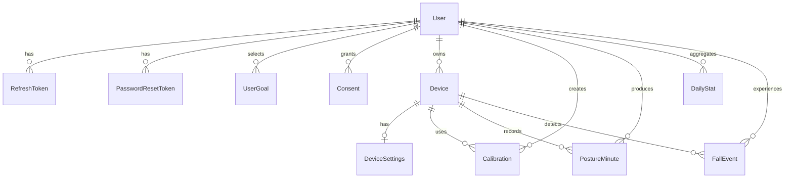

# KILYA Veritabanı Tasarımı

Bu belge KILYA backend veritabanının mevcut durumunu, hedef veri modelini,
ilişkileri ve geliştirme önerilerini açıklar. Kaynak gerçekliği
`prisma/schema.prisma` ile `prisma/migrations/` klasörüdür. Bu belge şemayı
açıklar; migration yerine geçmez.

Son güncelleme: 17 Eylül 2026

## 1. Teknoloji ve kapsam

- Veritabanı: PostgreSQL 17
- ORM ve migration: Prisma 7
- Yerel geliştirme: Docker Compose
- Kimlikler: Uygulama düzeyinde UUID (mevcut migrationda PostgreSQL `TEXT`),
  yoğun zaman serisinde BigInt
- Zaman: Olay zamanları UTC; günlük özet tarihi kullanıcının saat dilimine göre
- Hassasiyet: Profil ve duruş kayıtları kişisel/sağlık verisi olarak ele alınır

## 2. Bugün çalışan şema

İlk migration yalnızca kimlik doğrulamanın temelini oluşturan üç tabloyu
yaratır:



### User

Kullanıcı hesabını ve temel profili saklar. E-posta ve parola anonim veya
Google hesabında boş olabilir. `deletedAt` fiziksel silme yerine hesabın
silinmiş sayılmasını destekler.

| Alan | Tür | Boş? | Kural / anlam |
|---|---|---:|---|
| id | Text (UUID değeri) | Hayır | Birincil anahtar |
| email | Text | Evet | Benzersiz; giriş adresi |
| passwordHash | Text | Evet | Argon2 özeti; düz parola saklanmaz |
| googleId | Text | Evet | Benzersiz Google kullanıcı kimliği |
| isAnonymous | Boolean | Hayır | Varsayılan `false` |
| displayName | Text | Evet | Görünen ad |
| birthYear | Integer | Evet | Doğum yılı |
| heightCm | Integer | Evet | Santimetre cinsinden boy |
| weightKg | Integer | Evet | Kilogram cinsinden ağırlık |
| timezone | Text | Hayır | Varsayılan `Europe/Istanbul` |
| createdAt | Timestamp | Hayır | Oluşturulma zamanı |
| updatedAt | Timestamp | Hayır | Prisma tarafından güncellenir |
| deletedAt | Timestamp | Evet | Soft delete zamanı |

Hesap türüne göre beklenen durum:

| Hesap türü | email | passwordHash | googleId | isAnonymous |
|---|---:|---:|---:|---:|
| E-posta hesabı | Dolu | Dolu | Boş olabilir | false |
| Google hesabı | Dolu | Boş olabilir | Dolu | false |
| Anonim hesap | Boş | Boş | Boş | true |

### RefreshToken

Oturum yenileme belirteçlerini yalnızca özetlenmiş biçimde saklar. Bir
kullanıcının birden çok cihazda veya oturumda aktif tokenı olabilir.
Kullanıcı silinirse tokenlar `ON DELETE CASCADE` ile silinir.

`userId` indekslidir, `tokenHash` benzersizdir. `revokedAt` doluysa token iptal
edilmiştir; `expiresAt` geçmişse süresi dolmuştur.

### PasswordResetToken

Parola sıfırlama belirtecinin özetini, son kullanma zamanını ve kullanılıp
kullanılmadığını tutar. Kullanıcı silinince kayıtlar zincirleme silinir.
`tokenHash` benzersizdir.

## 3. Hedef şema

Yol haritasındaki hedef model aşağıdaki alanları kapsar. Bunlar henüz mevcut
migration içinde değildir; ilgili özellik geliştirilirken ayrı migrationlarla
eklenmelidir.



| Model | Amaç | Ana kural |
|---|---|---|
| UserGoal | Kullanıcının duruş, ağrı veya kifoz hedefleri | Kullanıcı + hedef türü benzersiz |
| Consent | KVKK ve araştırma onay geçmişi | Onay türü, metin sürümü ve iptal zamanı saklanır |
| Device | Fiziksel KILYA cihazı | `hardwareId` benzersiz |
| DeviceSettings | Cihaza ait eşik ve titreşim ayarları | Cihaz başına en fazla bir kayıt |
| Calibration | Cihazın referans pitch/roll değerleri | Aktif kalibrasyon cihaz bazında sorgulanır |
| PostureMinute | Dakikalık duruş özeti | Kullanıcı + cihaz + dakika benzersiz |
| DailyStat | Günlük önceden hesaplanmış istatistik | Kullanıcı + tarih birleşik anahtar |
| FallEvent | Düşme algılama olayı ve kullanıcı doğrulaması | İstemci olay kimliği benzersiz |
| Recommendation | Bölge ve yük eşiğine göre öneri kataloğu | `code` benzersiz |

### Veri akışı

1. Android uygulaması BLE üzerinden cihaz verisini alır.
2. Telefonda saniyelik örnekler dakikalık `PostureMinute` özetine çevrilir.
3. API aynı dakikanın yeniden gönderilmesini birleşik benzersiz anahtarla
   güvenli biçimde reddeder veya upsert eder.
4. Günlük toplulaştırma `DailyStat` kaydını üretir.
5. Bölgesel yük değerleri uygun `Recommendation` kayıtlarıyla eşleştirilir.
6. Düşme algısı `clientEventId` sayesinde ağ tekrarlarında çoğaltılmaz.

## 4. İlişki ve silme davranışı

Hedef modellerin kullanıcıya veya cihaza bağlı kayıtları `ON DELETE CASCADE`
olarak planlanmıştır. Bu, fiziksel kullanıcı silme işlemini kolaylaştırır.
Ancak `User.deletedAt` ile soft delete kullanıldığı sürece zincirleme silme
çalışmaz; kayıtlar veritabanında kalır. Hesap silme akışı şu iki aşamayı açıkça
tanımlamalıdır:

1. Kullanıcı erişimini hemen kapat ve `deletedAt` değerini yaz.
2. Yasal saklama süresi sonunda kullanıcıyı fiziksel silerek ilişkili kayıtları
   temizle veya anonimleştir.

## 5. Yerel veritabanını çalıştırma

Ana geliştirme veritabanı `5432`, test veritabanı `5433` portundadır.

```powershell
docker compose up -d db
npm run db:generate
npm run db:migrate
npm run db:seed
```

Şemayı görsel olarak incelemek için:

```powershell
npm run db:studio
```

Migration oluştururken açıklayıcı ad kullanılır:

```powershell
npx prisma migrate dev --name add_devices
```

Üretimde `migrate dev` kullanılmaz; hazırlanmış migrationlar
`npx prisma migrate deploy` ile uygulanır. `.env` ve bağlantı parolaları Git'e
eklenmez.

## 6. Önerilen iyileştirmeler

### P0 — Yeni özelliklerden önce

1. **Hesap bütünlüğü kısıtı ekle.** Bugünkü şema e-posta, Google kimliği ve
   anonimlik alanlarının tamamı boş olan normal bir hesaba izin veriyor.
   PostgreSQL `CHECK` kısıtıyla anonim hesabın kimlik bilgisiz, kalıcı hesabın
   ise en az bir giriş yöntemine sahip olması garanti edilmeli.
2. **E-postayı normalize et.** Kayıt ve girişte `trim + lowercase` uygulanmalı.
   Büyük/küçük harfe duyarsız benzersizlik için PostgreSQL `citext` veya
   `lower(email)` unique index değerlendirilmeli.
3. **Test veritabanını ayır.** E2E testleri bugün geliştirme `.env` bağlantısını
   kullanıyor. `db-test` için ayrı URL ve test öncesi migration adımı eklenmeli.
4. **Parola sıfırlama sorgularını indeksle.** Süresi dolmuş kayıt temizliği ve
   kullanıcı bazlı iptal için `PasswordResetToken(userId)` ve zaman alanlarına
   uygun indeks eklenmeli.

### P1 — Duruş verisi eklenirken

1. **Sayısal aralıkları veritabanında doğrula.** `score` 0–100,
   `goodSeconds`/`badSeconds` 0–60, `confidence` 0–1, boy/kilo ve hedef dakika
   alanları için `CHECK` kısıtları kullanılmalı. Prisma şemasının ifade
   edemediği kısıtlar migration SQL'ine yazılabilir.
2. **Sahiplik tutarlılığını koru.** `PostureMinute` içinde hem `userId` hem
   `deviceId` bulunması hızlı sorgu sağlar fakat farklı kullanıcılara ait
   değerlerin yanlış eşleşmesine izin verebilir. Birleşik yabancı anahtar veya
   servis katmanında transaction içi sahiplik doğrulaması zorunlu olmalı.
3. **Aktif kalibrasyonu tekilleştir.** Bir cihazda aynı anda yalnızca bir aktif
   kalibrasyon bulunması için `WHERE isActive = true` koşullu unique index
   eklenmeli.
4. **Zaman standardını kesinleştir.** `minuteStart` UTC ve saniye/milisaniye
   sıfır olacak şekilde API'de doğrulanmalı. `DailyStat.date` kullanıcının IANA
   saat dilimine göre hesaplanmalı; saat dilimi değişikliğinin geçmiş özetlere
   etkisi tanımlanmalı.
5. **JSON alanını sözleşmeye bağla.** `regionLoads` esnekliği yararlı olsa da
   kabul edilen anahtarlar ve 0–1 aralığı DTO doğrulamasıyla sınırlandırılmalı.
   Bölgeler üzerinde yoğun SQL sorgusu yapılacaksa JSON yerine ayrı tablo daha
   uygun olur.

### P2 — Üretim ve büyüme

1. **Saklama politikası belirle.** Dakikalık sağlık verisinin kaç ay/yıl
   tutulacağı açıkça yazılmalı; silme veya anonimleştirme görevi otomatik
   çalışmalıdır.
2. **Büyük tablo planı yap.** `PostureMinute` büyüdüğünde `(userId,
   minuteStart)` indeksi temel sorguları taşır. Veri milyonlarca satıra
   ulaştığında aylık zaman bölümlendirme ve eski veri arşivleme ölçülerek
   değerlendirilmelidir; başlangıçta gereksiz karmaşıklık eklenmemelidir.
3. **Yedeklemeyi geri yükleyerek test et.** Günlük yedek tek başına yeterli
   değildir; düzenli geri yükleme testi ve hedeflenen RPO/RTO yazılmalıdır.
4. **Denetim izi ekle.** Onay metni sürümü, onayın kaynağı ve kritik hesap
   değişiklikleri için gereken denetim kayıtları kişisel veriyi gereksiz yere
   çoğaltmadan tutulmalıdır.
5. **Şifreleme ve erişim sınırları uygula.** Yönetilen PostgreSQL disk
   şifrelemesi, TLS bağlantısı, en az yetkili uygulama kullanıcısı ve ayrı
   migration rolü kullanılmalıdır.

## 7. Uygulama sırası önerisi

Veritabanını bir kerede tam hedef şemaya geçirmek yerine özelliklerle birlikte
büyütmek daha güvenlidir:

1. Auth: mevcut üç tablo + bütünlük kısıtları ve indeksler.
2. Profil: `UserGoal`, `Consent`.
3. Cihaz: `Device`, `DeviceSettings`, `Calibration`.
4. Veri alımı: `PostureMinute` ve veri doğrulama kısıtları.
5. İstatistik: `DailyStat` ve toplulaştırma işi.
6. Olay/öneri: `FallEvent`, `Recommendation` ve seed verisi.
7. Üretim: saklama, anonimleştirme, yedekleme ve izleme.

Her adım ayrı migration, kod incelemesi ve geri yüklenebilir yedek sonrasında
uygulanmalıdır. Migration dosyaları çalıştırıldıktan sonra değiştirilmemeli;
yeni düzeltme yeni migration olarak eklenmelidir.
